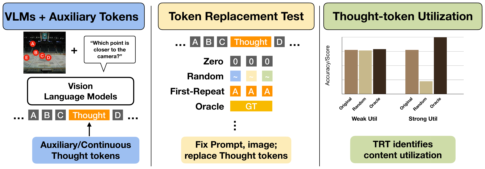

# Ablate-to-Validate: Are Vision-Language Models Really Using Continuous Thought Tokens?

\[[arXiv](TODO: add arXiv link)\] &nbsp; \[[Paper PDF](docs/assets/atv_paper.pdf)\] &nbsp; \[[Project Page](https://tjazhang.github.io/ablate_to_validate/)\]

Tianyi Zhang<sup>*</sup>, [Mahtab Bigverdi](https://mahtabbigverdi.github.io/)<sup>*</sup>, [Ranjay Krishna](https://www.ranjaykrishna.com/)

<sup>*</sup>Equal contribution

### Abstract

Vision-language models (VLMs) are increasingly augmented with continuous or latent non-textual tokens intended to support "visual thinking." Despite the improved task accuracy, this alone does not show that models actually use these tokens for reasoning. Gains may instead arise from confounds such as added context length, special-token anchoring, or training-time regularization. We formalize a diagnostic principle, **Ablate-to-Validate**, for testing whether latent-token content is genuinely utilized. We instantiate this principle as the **Token Replacement Test (TRT)**, a standardized suite of content-replacement ablations. TRT measures whether performance depends on the information carried by latent tokens rather than their mere presence. It probes (1) *span-position bias* through zero and random replacement, (2) disentangles *token-budget from token-diversity* effects through first-repeat and count-matched variants, and (3) evaluates information content using oracle or *ground-truth token injection* together with distribution-matched random baselines. As a controlled testbed, we study relative depth reasoning, where continuous depth embeddings can be inserted at explicit span positions under a fixed token budget. We train LLaVA and Qwen2.5-VL models both to predict and to consume these tokens, and show that TRT applies across heterogeneous latent-token model backbones. Concretely, we cover two trained backbones (LLaVA-13B, Qwen2.5-VL-3B) with continuous and discrete depth spans across three frozen visual encoders (SigLIP2, CLIP, DINOv2) and multiple token budgets, and additionally apply TRT to three off-the-shelf visual-thinking systems (Mirage, Mull-Tokens, CoVT) evaluated on BLINK, VSP, and CV-Bench. Our results show that accuracy gains can be a misleading proxy for latent-token reasoning: across multiple model backbones, types of continuous visual tokens, and compute budgets, VLMs retain most of the improvement even when latent-token content is corrupted or replaced, revealing a persistent gap between "having a latent channel" and actually using it as an information bottleneck. By separating true content utilization from alternative explanations, TRT provides a simple and standardized way to evaluate continuous thought tokens in vision-language models, and we recommend reporting such diagnostics as standard practice.

<p align="center">
  <a href="assets/AtV_figure.png">
    
  </a>
</p>

<p align="center">
  <video src="docs/assets/atv_teaser.mp4" autoplay loop muted playsinline controls width="700">
    Your browser does not render embedded video. <a href="docs/assets/atv_teaser.mp4">Watch the animated explainer (MP4)</a>.
  </video>
</p>

<p align="center">
  <em>▶ <a href="docs/assets/atv_teaser.mp4">animated explainer</a> · <a href="https://tjazhang.github.io/ablate_to_validate/">project page</a> · <a href="assets/teaser_animation/">animation source</a></em>
</p>

---

## Repository

This repository has five runnable surfaces:

- `methods/llava`: vendored LLaVA snapshot with Aurora depth work
- `methods/qwen`: vendored Qwen snapshot with Aurora depth work
- `overlays/mirage`: external upstream + Aurora override layer
- `overlays/mull`: external upstream + Aurora override layer
- `overlays/covt`: external upstream + Aurora override layer

If you are new here, use the docs in this order:

1. [`docs/ENV_SETUP.md`](docs/ENV_SETUP.md)
2. The guide for the method you want to run
3. [`docs/structure.md`](docs/structure.md) if you need repo internals

Maintenance notes such as `UPSTREAM_DIFF.md`, `REMOVE_CANDIDATES.md`, and `POLISHED_*.md` are not the primary runbooks.

## Method Index

| Component | Kind | Conda env | Bootstrap needed | Canonical entrypoints | User guide |
| --- | --- | --- | --- | --- | --- |
| LLaVA | vendored | `llava` | no | `python -m llava.eval.run_llava`, `python model_vqa_depth_continuous.py`, `python -m llava.eval.model_vqa_depth_discrete` | [`methods/llava/USER_GUIDE.md`](methods/llava/USER_GUIDE.md) |
| Qwen | vendored | `qwen_vl` | no | `bash methods/qwen/qwen-vl-finetune/scripts/train_ade_*.sh`, `bash methods/qwen/qwen-vl-finetune/eval_qwen.sh`, `python methods/qwen/web_demo_mm.py` | [`methods/qwen/USER_GUIDE.md`](methods/qwen/USER_GUIDE.md) |
| Mirage | overlay | `mirage` | `./tools/bootstrap_overlay.py mirage` | `./tools/eval_mirage.sh`, `./tools/eval_mirage_depth.sh`, `./tools/train_mirage_depth.sh` | [`overlays/mirage/USER_GUIDE.md`](overlays/mirage/USER_GUIDE.md) |
| Mull | overlay | `mull` | `./tools/bootstrap_overlay.py mull` | `./tools/eval_mull.sh` | [`overlays/mull/USER_GUIDE.md`](overlays/mull/USER_GUIDE.md) |
| CoVT | overlay | `covt` | `./tools/bootstrap_overlay.py covt` | `./tools/eval_covt.sh` | [`overlays/covt/USER_GUIDE.md`](overlays/covt/USER_GUIDE.md) |

## First-Time Setup

From the repo root:

```bash
cd /path/to/Ablate-to-Validate
```

If you will use an overlay method, materialize its upstream checkout first:

```bash
./tools/bootstrap_overlay.py --dry-run mirage
./tools/bootstrap_overlay.py mirage
```

Then activate the matching env and follow that method's guide.

## Repo Layout

- `methods/`
  - vendored runnable source trees for LLaVA and Qwen
- `overlays/`
  - Aurora-owned patch/override layers for Mirage, Mull, and CoVT
- `external/`
  - generated upstream checkouts for the overlay methods
  - intentionally git-ignored
- `envs/`
  - exported conda env snapshots using the same env names as the original working setup
- `tools/bootstrap_overlay.py`
  - clones pinned overlay repos, checks out the locked commit, applies patches, and copies override files

## Additional Docs

- [`docs/ENV_SETUP.md`](docs/ENV_SETUP.md): shared environment setup and recreation guide
- [`docs/structure.md`](docs/structure.md): repo organization
- [`third_party/THIRD_PARTY_NOTICES.md`](third_party/THIRD_PARTY_NOTICES.md): upstream provenance and notices
